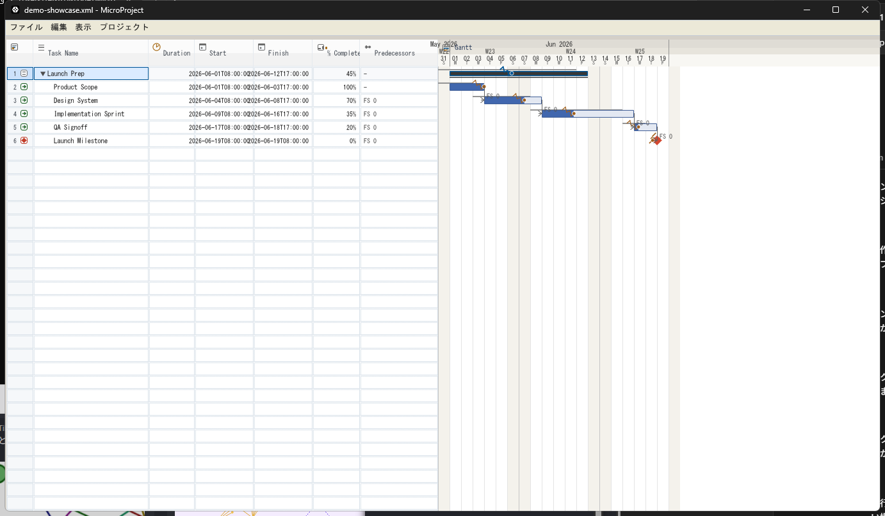

# MicroProject

MicroProject is a Windows-focused Rust desktop app for opening Microsoft Project XML files and viewing them as a split task list plus Gantt chart.

## Preview



## Snapshot

- Native Rust desktop app built with `egui` and `eframe`.
- Reads Microsoft Project XML and renders the schedule as a clean, editable-looking Gantt view.
- Highlights task structure, dependencies, progress, and baseline drift in a single screen.

## Why It Stands Out

- Office-inspired layout with a split sheet-and-chart workflow.
- Dependency lines and progress visuals are drawn directly on the chart, so schedule relationships are easy to read at a glance.
- The app is backed by a forgiving XML import path, so real-world Project files with extra fields still open cleanly.

## Demo File

- Open [`projectlibre-tauri/testdata/demo-showcase.xml`](./projectlibre-tauri/testdata/demo-showcase.xml) to see a polished sample schedule with summary tasks, dependencies, milestones, and baseline data.

## Quick Start

```powershell
cd projectlibre-tauri
cargo run -- "C:\path\to\project.xml"
```

Or use the bundled showcase sample:

```powershell
cd projectlibre-tauri
cargo run -- ".\testdata\demo-showcase.xml"
```

## Design Goals

- Keep the app simple to build and easy to inspect.
- Prefer proven Rust crates for parsing, dialogs, and UI widgets.
- Preserve the original task order, dates, hierarchy, and dependency shape from the XML.
- Keep the UI legible enough that a sample project can double as a portfolio screenshot.

## What It Includes

- [`projectlibre-tauri/`](./projectlibre-tauri): the active Rust viewer application.
- [`upstream/projectlibre-snapshot/`](./upstream/projectlibre-snapshot): a reference-only upstream source snapshot kept for layout and behavior comparison.
- [`NOTICE`](./NOTICE): repository-wide provenance notes.

## Notes

- The upstream snapshot is reference material only and is not part of the runtime path.
- Any ProjectLibre-related source under `upstream/` remains isolated from the Rust viewer.
- See [`ROADMAP.md`](./ROADMAP.md) for the current product direction.
