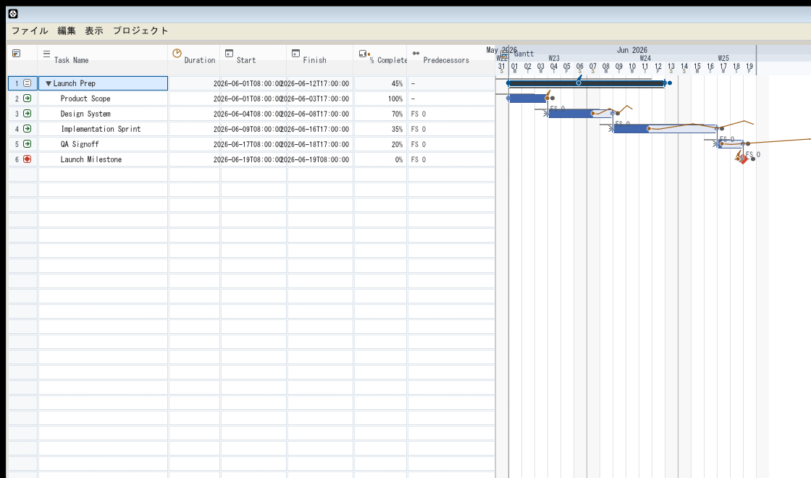
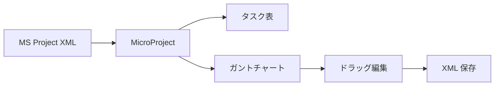

# MicroProject

Rust で作った、MS Project 風のガントチャート編集アプリです。

タスク表とガントを一画面で扱い、ドラッグで日付を動かし、依存関係を線でつなぎ、XML で保存できます。


<p align="center">
  
</p>

## できること

| 機能 | 内容 |
|---|---|
| 直接操作 | ガントバーをドラッグして開始日・終了日を調整 |
| 依存関係 | タスク間の前後関係を作成し、`FS / SS / FF / SF` に対応 |
| 視認性 | 今日線、週末、月境界、依存線を見やすく表示 |
| 編集体験 | Undo / Redo、ステータス表示、ホバー説明を用意 |
| XML 対応 | MS Project 系の XML を読み込み・保存 |
| タスク編集 | 名前、期間、開始/終了、進捗、制約などを編集 |

## 画面イメージ

スクリーンショットでは、左にタスク表、右にガントチャートを並べたレイアウトを見られます。
タスクの進行状況や依存関係がひと目で追えるよう、情報量を整理しつつ操作点を強調しています。

## 使い方

1. アプリを起動します。

```bash
cargo run -p microproject -- microproject/testdata/demo-showcase.xml
```

2. `microproject/testdata/demo-showcase.xml` を開きます。
3. タスク表またはガントチャート上で、タスクを選択・移動・編集します。

## 開発

```bash
cargo test -p microproject
```

## ワークフロー



## プロジェクトの特徴

- Rust らしい安全なデータ処理と、軽快なデスクトップ UI を両立しています。
- できるだけ Excel / Project 風の感覚を保ちながら、素早い編集に寄せています。
- デモデータでそのまま触れるので、起動後すぐに動作確認できます。

## ライセンス

Apache-2.0
